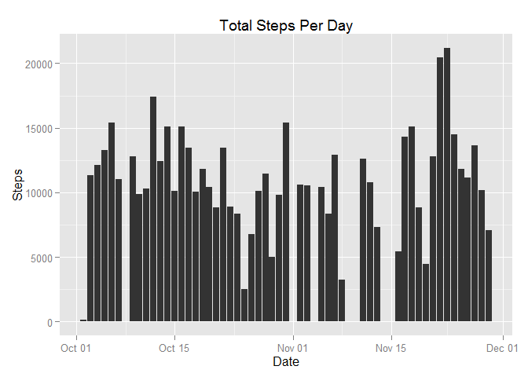
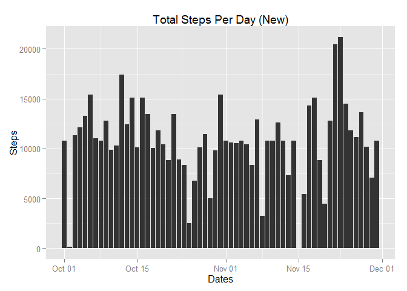
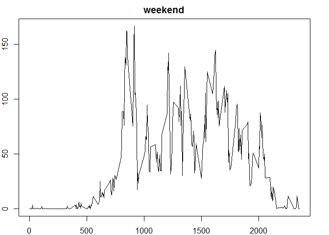
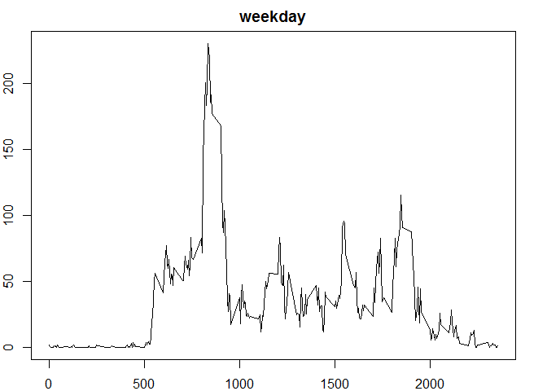

# Reproducible Research: Peer Assessment 1


## Loading and preprocessing the data

```r
library(ggplot2)
library(plyr)
library(dplyr)
```

```
## 
## Attaching package: 'dplyr'
## 
## The following objects are masked from 'package:plyr':
## 
##     arrange, count, desc, failwith, id, mutate, rename, summarise,
##     summarize
## 
## The following objects are masked from 'package:stats':
## 
##     filter, lag
## 
## The following objects are masked from 'package:base':
## 
##     intersect, setdiff, setequal, union
```

```r
library(lubridate)
```

```
## 
## Attaching package: 'lubridate'
## 
## The following object is masked from 'package:plyr':
## 
##     here
```

```r
activity <- read.csv("C:/Users/i55802/RepData_PeerAssessment1/activity.csv", colClasses = c("numeric","character","integer"))
```

## What is mean total number of steps taken per day?

```r
total_steps <- tapply(activity$steps, activity$date, FUN = sum, na.rm = TRUE)
activity$date <- ymd(activity$date)
daily_steps <- activity %>%
        filter(!is.na(steps)) %>%
        group_by(date) %>%
        summarize(steps = sum(steps)) %>%
        print
```

```
## Source: local data frame [53 x 2]
## 
##          date steps
##        (time) (dbl)
## 1  2012-10-02   126
## 2  2012-10-03 11352
## 3  2012-10-04 12116
## 4  2012-10-05 13294
## 5  2012-10-06 15420
## 6  2012-10-07 11015
## 7  2012-10-09 12811
## 8  2012-10-10  9900
## 9  2012-10-11 10304
## 10 2012-10-12 17382
## ..        ...   ...
```

```r
ggplot(daily_steps, aes(x=date, y=steps))+geom_histogram(stat="identity")+xlab("Date")+ylab("Steps")+labs(title="Total Steps Per Day")
```

 

```r
mean(total_steps)
```

```
## [1] 9354.23
```

```r
median(total_steps)
```

```
## [1] 10395
```

## What is the average daily activity pattern?

```r
daily_activity <- activity %>%
                filter(!is.na(steps)) %>%
                group_by(interval) %>%
                summarize(steps = mean(steps)) %>%
                print
```

```
## Source: local data frame [288 x 2]
## 
##    interval     steps
##       (int)     (dbl)
## 1         0 1.7169811
## 2         5 0.3396226
## 3        10 0.1320755
## 4        15 0.1509434
## 5        20 0.0754717
## 6        25 2.0943396
## 7        30 0.5283019
## 8        35 0.8679245
## 9        40 0.0000000
## 10       45 1.4716981
## ..      ...       ...
```

```r
plot(daily_activity, type = "l")
```

 

```r
daily_activity[which.max(daily_activity$steps),]$interval
```

```
## [1] 835
```

## Imputing missing values

```r
missing <- sum(is.na(activity))
missing
```

```
## [1] 2304
```

```r
new_activity <- activity %>%
                group_by(interval) %>%
                mutate(steps = ifelse(is.na(steps), mean(steps, na.rm = TRUE), steps))
new_activity
```

```
## Source: local data frame [17,568 x 3]
## Groups: interval [288]
## 
##        steps       date interval
##        (dbl)     (time)    (int)
## 1  1.7169811 2012-10-01        0
## 2  0.3396226 2012-10-01        5
## 3  0.1320755 2012-10-01       10
## 4  0.1509434 2012-10-01       15
## 5  0.0754717 2012-10-01       20
## 6  2.0943396 2012-10-01       25
## 7  0.5283019 2012-10-01       30
## 8  0.8679245 2012-10-01       35
## 9  0.0000000 2012-10-01       40
## 10 1.4716981 2012-10-01       45
## ..       ...        ...      ...
```

```r
total_new <- tapply(new_activity$steps, new_activity$date, FUN = sum, na.rm = TRUE)
new_activity$date <- ymd(new_activity$date)
new_steps <- new_activity %>%
                group_by(date) %>%
                summarize(steps = sum(steps)) %>%
                print
```

```
## Source: local data frame [61 x 2]
## 
##          date    steps
##        (time)    (dbl)
## 1  2012-10-01 10766.19
## 2  2012-10-02   126.00
## 3  2012-10-03 11352.00
## 4  2012-10-04 12116.00
## 5  2012-10-05 13294.00
## 6  2012-10-06 15420.00
## 7  2012-10-07 11015.00
## 8  2012-10-08 10766.19
## 9  2012-10-09 12811.00
## 10 2012-10-10  9900.00
## ..        ...      ...
```

```r
ggplot(new_steps, aes(x=date, y=steps))+geom_histogram(stat="identity")+xlab("Dates")+ylab("Steps")+labs(title = "Total Steps Per Day (New)")
```

 

```r
mean(total_new)
```

```
## [1] 10766.19
```

```r
median(total_new)
```

```
## [1] 10766.19
```

```r
mean(total_steps) == mean(total_new)
```

```
## [1] FALSE
```

```r
median(total_steps) == median(total_new)
```

```
## [1] FALSE
```

```r
summary(total_new) - summary(total_steps)
```

```
##    Min. 1st Qu.  Median    Mean 3rd Qu.    Max. 
##      41    3041     370    1416       0       0
```

## Are there differences in activity patterns between weekdays and weekends?

```r
dayofweek <- function(date) {
        if (weekdays(as.Date(date)) %in% c("Saturday", "Sunday")) {
                "weekend"
        } else {
                "weekday"
        }
}
new_activity$daytype <- as.factor(sapply(new_activity$date, dayofweek))
par(mar = rep(2, 4))
for (type in c("weekend", "weekday")) {
        steps_type <- aggregate(steps ~ interval, data = new_activity, subset = new_activity$daytype == type, FUN = mean)
        plot(steps_type, type = "l", main = type)
}
```

  

